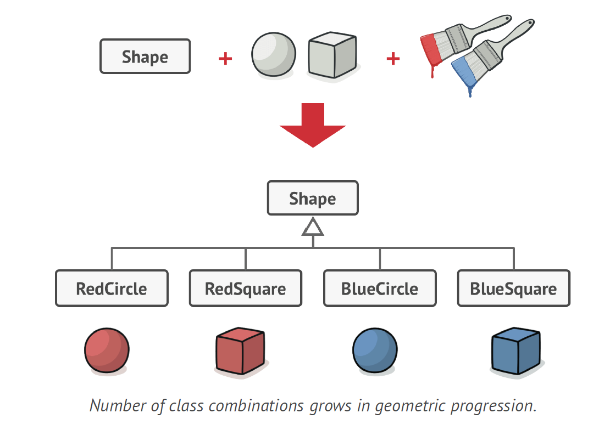
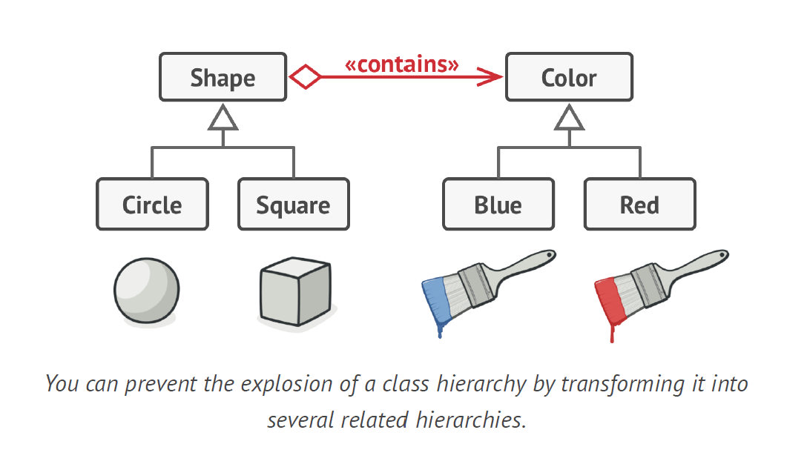

# Bridge Design Pattern

- Bridge is a structural design pattern that lets you split a large
  class or a set of closely related classes into two separate
  hierarchies—abstraction and implementation—which can be
  developed independently of each other.

Problem -

- Say you have a geometric Shape class with a pair of subclasses:
  Circle and Square . You want to extend this class hierarchy
  to incorporate colors, so you plan to create Red and Blue
  shape subclasses. However, since you already have two subclasses,
  you’ll need to create four class combinations such as
  BlueCircle and RedSquare .
- Adding new shape types and colors to the hierarchy will grow
  it exponentially.
  

Solution -

- This problem occurs because we’re trying to extend the shape
  classes in two independent dimensions: by form and by color.
  That’s a very common issue with class inheritance.
  The Bridge pattern attempts to solve this problem by switching
  from inheritance to composition. What this means is that
  you extract one of the dimensions into a separate class hierarchy,
  so that the original classes will reference an object of the
  new hierarchy, instead of having all of its state and behaviors
  within one class.
