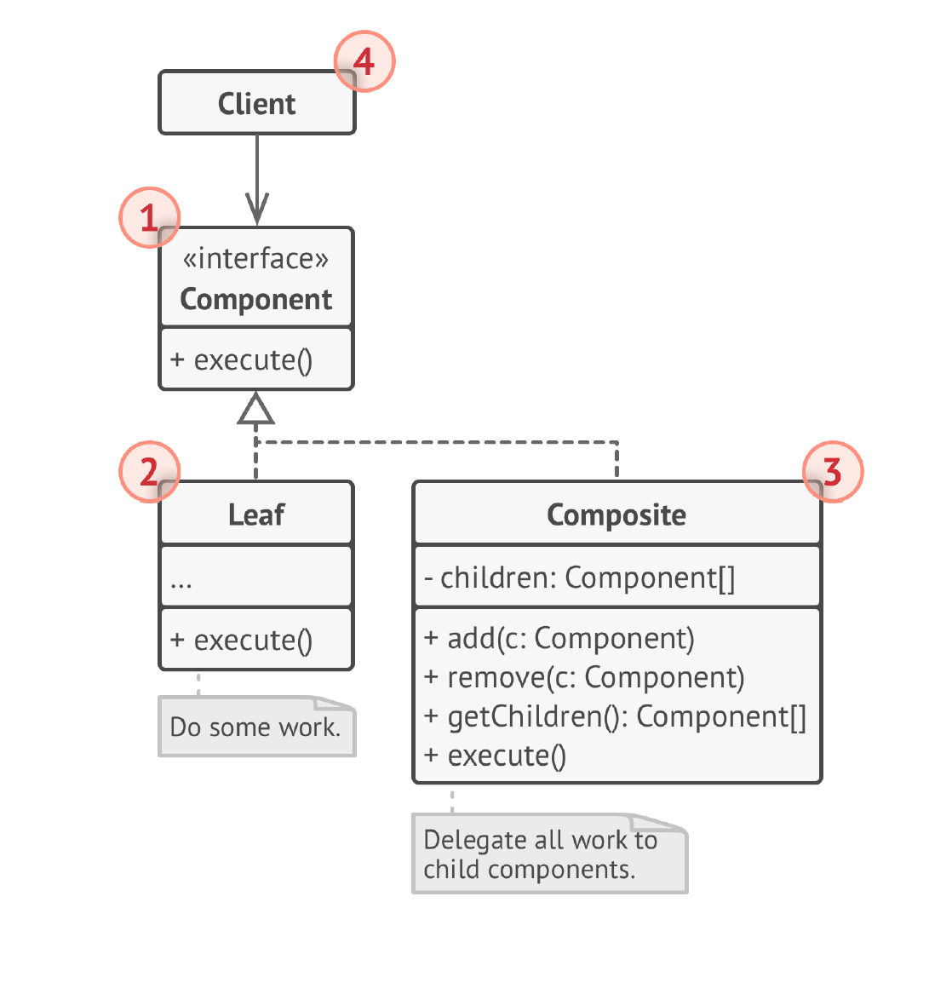

# Composite Design Pattern

Composite design pattern is used where we need to treat a group of objects in similar way as a single object.
Composite pattern composes objects in terms of a tree structure to represent part as well as whole hierarchy. This type
of design pattern comes under structural pattern as this pattern creates a tree structure of group of objects.

Composite is a structural design pattern that lets you compose objects into tree structures and then work with these
structures as if they were individual objects.

For example, imagine that you have two types of objects: Products and Boxes . A Box can contain several Products as well
as a number of smaller Boxes . These little Boxes can also hold some Products or even smaller Boxes , and so on.

# Applicability

Use the Composite pattern when you have to implement a tree-like object structure.
Use the pattern when you want the client code to treat both simple and complex elements uniformly.

# Structure

1. The Component interface describes operations that are common
   to both simple and complex elements of the tree.
2. The Leaf is a basic element of a tree that doesn’t have sub-elements.
   Usually, leaf components end up doing most of the real work,
   since they don’t have anyone to delegate the work to.
3. The Container (aka composite) is an element that has sub-elements:
   leaves or other containers. A container doesn’t know
   the concrete classes of its children. It works with all sub-elements
   only via the component interface.
   Upon receiving a request, a container delegates the work to its
   sub-elements, processes intermediate results and then returns
   the final result to the client.
4. The Client works with all elements through the component
   interface. As a result, the client can work in the same way with
   both simple or complex elements of the tree.