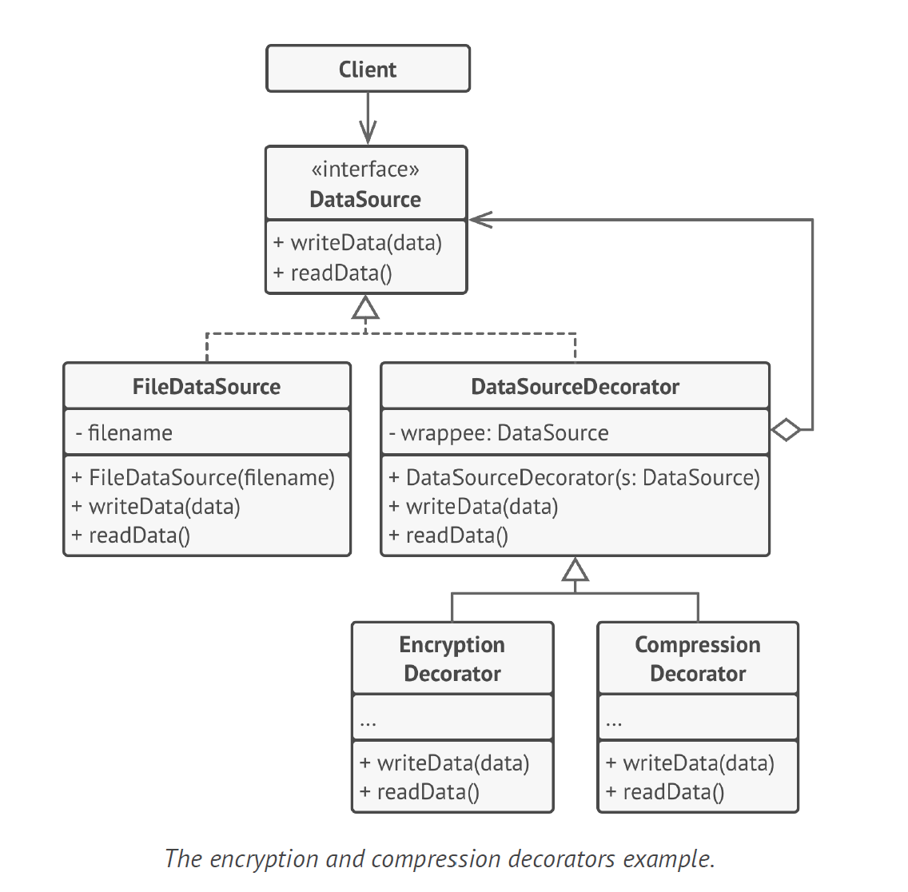

# Decorator Design Pattern

Decorator is a structural design pattern that lets you attach new behaviors to objects by placing these objects inside
special wrapper objects that contain the behaviors.

- **Attaches additional responsibilities** to an object **dynamically**.
- Provides an alternative for sub-classing i.e. extending functionality.
- It changes one form to another form.
- Inheritance is not for code reuse or sharing behavior, in-fact it is composition that allows you to share behavior.

Purpose -

- Use this majorly to avoid class explosion that is caused by IS-A

Structure -

1. The Component declares the common interface for both wrappers
   and wrapped objects.
2. Concrete Component is a class of objects being wrapped. It
   defines the basic behavior, which can be altered by decorators.
3. The Base Decorator class has a field for referencing a wrapped
   object. The field’s type should be declared as the component
   interface so it can contain both concrete components and decorators.
   The base decorator delegates all operations to the
   wrapped object.
4. Concrete Decorators define extra behaviors that can be added
   to components dynamically. Concrete decorators override
   methods of the base decorator and execute their behavior
   either before or after calling the parent method.
5. The Client can wrap components in multiple layers of decorators,
   as long as it works with all objects via the component
   interface.

Example -

The application wraps the data source object with a pair of decorators. Both wrappers change the way the data is written
to and read from the disk:
• Just before the data is written to disk, the decorators encrypt and compress it. The original class writes the
encrypted and protected data to the file without knowing about the change.
• Right after the data is read from disk, it goes through the same decorators, which decompress and decode it.

The decorators and the data source class implement the same interface, which makes them all interchangeable in the
client code.