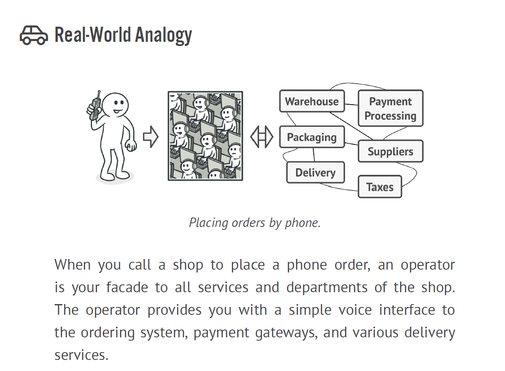
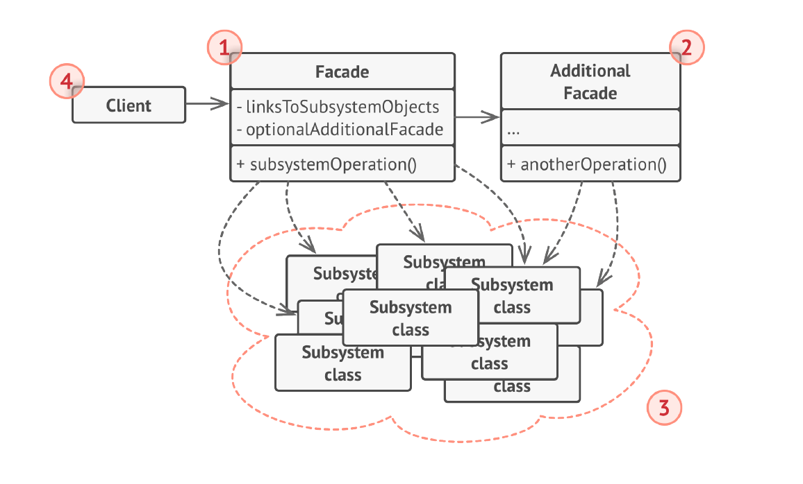

# FACADE DP

- Facade is a structural design pattern that provides a simplified interface to a library, a framework, or any other
  complex set of classes.
- Provide a unified interface to a set of interfaces in a subsystem.
- Facade defines a higher-level interface that makes the subsystem easier to use.
- Wrap a complicated subsystem with a simpler interface.

**Problem**

A segment of the client community needs a simplified interface to the overall functionality of a complex subsystem.

Problem -
Imagine that you must make your code work with a broad set of objects that belong to a sophisticated library or
framework. Ordinarily, you’d need to initialize all of those objects, keep track of dependencies, execute methods in the
correct order, and so on.
As a result, the business logic of your classes would become tightly coupled to the implementation details of 3rd-party
classes, making it hard to comprehend and maintain.

**Solution**

- Facade discusses encapsulating a complex subsystem within a single interface object.
- This reduces the learning curve necessary to successfully leverage the subsystem. It also promotes decoupling the
  subsystem from its potentially many clients. On the other hand, if the Facade is the only access point for the
  subsystem, it will limit the features and flexibility that "power users" may need.
- The Facade object should be a fairly simple advocate or facilitator. It should not become an all-knowing oracle or "
  god" object.

**Check list**

- Identify a simpler, unified interface for the subsystem or component.
- Design a 'wrapper' class that encapsulates the subsystem.
- The facade/wrapper captures the complexity and collaborations of the component, and delegates to the appropriate
  methods.
- The client uses (is coupled to) the Facade only.

Example -

Structure -

1. The Facade provides convenient access to a particular part
   of the subsystem’s functionality. It knows where to direct the
   client’s request and how to operate all the moving parts.
2. An Additional Facade class can be created to prevent polluting
   a single facade with unrelated features that might make it yet
   another complex structure. Additional facades can be used by
   both clients and other facades.
3. The Complex Subsystem consists of dozens of various objects.
   To make them all do something meaningful, you have to dive
   deep into the subsystem’s implementation details, such as initializing
   objects in the correct order and supplying them with
   data in the proper format.
   Subsystem classes aren’t aware of the facade’s existence. They
   operate within the system and work with each other directly.
4. The Client uses the facade instead of calling the subsystem
   objects directly.

Usage -

Use the Facade pattern when you need to have a limited but
straightforward interface to a complex subsystem.
Use the Facade when you want to structure a subsystem into
layers.