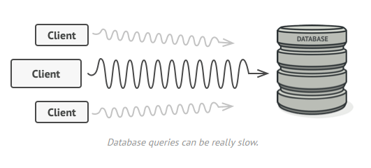
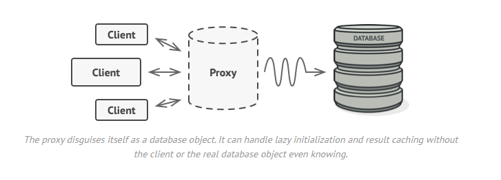

# PROXY DP

- Proxy is a structural design pattern that lets you provide a substitute or placeholder for another object.
- A proxy controls access to the original object, allowing you to perform something either before or after the request
  gets through to the original object.

**Problem**

Why would you want to control access to an object? Here is an example: you have a massive object that consumes a vast
amount of system resources. You need it from time to time, but not always.

You could implement lazy initialization: create this object only when it’s actually needed. All the object’s clients
would need to execute some deferred initialization code. Unfortunately, this would probably cause a lot of code
duplication.

**Solution**

The Proxy pattern suggests that you create a new proxy class with the same interface as an original service object. Then
you update your app so that it passes the proxy object for all calls to original object’s from clients. Upon receiving a
request from a client, the proxy creates a real service object and delegates all the work to it.

But what’s the benefit? If you need to execute something either before or after the primary logic of the class, the
proxy lets you do this without changing that class. Since the proxy implements the same interface as the original class,
it can be passed to any client that expects a real service object.

**Applicability**

Lazy initialization (virtual proxy). This is when you have a heavyweight service object that wastes system resources by
being always up, even though you only need it from time to time.

Access control (protection proxy). This is when you want only specific clients to be able to use the service object; for
instance, when your objects are crucial parts of an operating system and clients are various launched applications (
including malicious ones).

Logging requests (logging proxy). This is when you want to keep a history of requests to the service object.

Caching request results (caching proxy). This is when you need to cache results of client requests and manage the life
cycle of this cache, especially if results are quite large.

**Relations with Other Patterns**

- Adapter provides a different interface to the wrapped object, Proxy provides it with the same interface, and Decorator
  provides it with an enhanced interface.

- Facade is similar to Proxy in that both buffer a complex entity and initialize it on its own. Unlike Facade, Proxy has
  the same interface as its service object, which makes them interchangeable.

- Decorator and Proxy have similar structures, but very different intents. Both patterns are built on the composition
  principle, where one object is supposed to delegate some work to another. The difference is that a Proxy
  usually manages the life cycle of its service object on its own, whereas the composition of Decorators is always
  controlled by the client.

